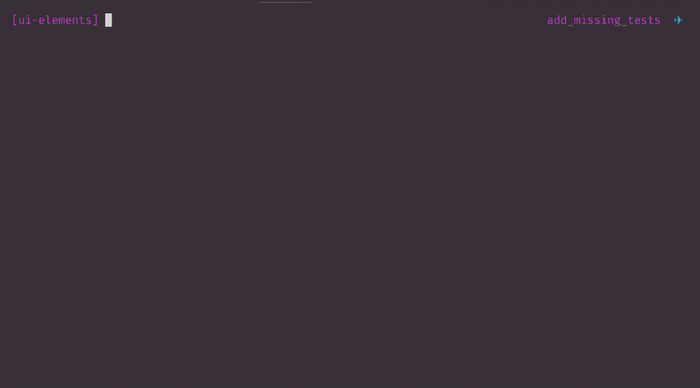

[](http://commitizen.github.io/cz-cli/)
[](https://lernajs.io/)
[](https://conventionalcommits.org)

# Relayr UI Elements

<!-- TOC -->

- [Relayr UI Elements](#relayr-ui-elements)
  - [Live Playground](#live-playground)
  - [Scripts](#scripts)
  - [Contributing](#contributing)
    - [Creating new package](#creating-new-package)
      - [Use create:package script if possible](#use-createpackage-script-if-possible)
      - [Creating new package manually](#creating-new-package-manually)
    - [Creating new components](#creating-new-components)
      - [Use create:component script if possible](#use-createcomponent-script-if-possible)
      - [Creating new components manually](#creating-new-components-manually)
  - [Making release](#making-release)

<!-- /TOC -->

## Live Playground

<details><summary>To run demo locally: (click to expand)</summary>

- Clone this repository
- Install dependencies via `yarn`
- `yarn run storybook`
- Visit [http://localhost:9001/](http://localhost:9001/)

</details>

## Scripts

Below is a list of scripts you can use while working with this repository. Preferably use Yarn to run them.

- <details>
    <summary>start</summary>

    Runs storybook on local machine. It also builds all packages to be sure that all cross dependencies between packages works.

    Usage example:

    ```bash
    yarn start
    ```

    *Aliases*: `sb`, `storybook`
    
    To run Storybook with *withInfo* addon the environment variable STORYBOOK_WITHINFO should be set to 1:
    
    ```
    STORYBOOK_WITHINFO="1"
    ```
  </details>

- <details>
    <summary>start:no-build</summary>

    Runs storybook on local machine without building packages.

    Usage example:

    ```bash
    yarn start
    ```

    *Aliases*: `sb:no-build`, `storybook:no-build`
    
    To run Storybook with *withInfo* addon the environment variable STORYBOOK_WITHINFO should be set to 1:
    
    ```
    STORYBOOK_WITHINFO="1"
    ```
  </details>

- <details>
    <summary>build</summary>

    Build all packages

    Usage example:

    ```bash
    yarn build
    ```
  </details>

- <details>
    <summary>test</summary>

    Run all tests

    Usage example:

    ```bash
    yarn test
    ```
  </details>

- <details>
    <summary>test:coverage</summary>
    Run all tests and open coverage summary in browser window.

    Usage example:

    ```bash
    yarn test:coverage
    ```
  </details>

- <details>
    <summary>test:watch</summary>

    Run all tests in watch mode.

    The same as `yarn test --watch`

    Usage example:

    ```bash
    yarn test:watch
    ```
  </details>

- <details>
    <summary>lint</summary>

    Run typescript linter.

    Usage example:

    ```bash
    yarn lint
    ```
  </details>

- <details>
    <summary>commit</summary>

    Make git commit by using commitizen.

    See [contributing](#contributing) section for more information.

    Usage example:

    ```bash
    yarn commit
    ```
  </details>

- <details>
    <summary>create:package</summary>

    Create new package if it not exists. It also creates basic file and folder structure inside new package.


    Usage example:

    ```bash
    yarn create:package
    ```
  </details>

- <details>
    <summary>create:component</summary>

    Create new component in given package (it will prompt for package name). It creates all required files for component:

    - test file
    - index file
    - component file
    - storybook file

    \
    Usage example:

    ```bash
    yarn create:component
    ```
  </details>

## Contributing

**Please do not use NPM for installing packages. Instead use Yarn as project is designed for Yarn workspaces.**

UI-Elements uses the [Conventional Commits](https://www.conventionalcommits.org/en/v1.0.0-beta.2/) specification. This means that every Pull Request must contain approvals with a description compliant with the "Conventional Commits" specification. Because we also use [Lerna](https://lernajs.io/) to manage multiple packages, the scope of the commit should be clearly defined as the name of one of the packages, e.g. `ui-elements-i18n`.

The easiest way to add new commits by convention is to use the [Commitizen](https://github.com/commitizen/cz-cli) tool. Installation is as simple as running the following command:

```bash
npm install -g commitizen
```

Now, simply use `git cz` instead of `git commit` when committing.



Alternatively, if you are using NPM 5.2+ you can use npx instead of installing globally: `npx git-cz` or as a script:

```bash
yarn commit
```

### Creating new package

#### Use create:package script if possible

```bash
yarn create:package
```

It will prompt for package name and create basic package structure with required files.

#### Creating new package manually

This project uses [Yarn Workspaces](https://yarnpkg.com/lang/en/docs/workspaces/) for distributing multiple packages within one, monolithic repository.

Each package should have following files:

**[package_name]** \
&nbsp;&nbsp;&nbsp;&nbsp;|- index.ts \
&nbsp;&nbsp;&nbsp;&nbsp;|- package.json \
&nbsp;&nbsp;&nbsp;&nbsp;|- README<span />.md

where: \
**index.ts** - is main package file. It should contain all import and exports required by package.

**package.json** - should contain only dependencies required by package itself. Package can have cross dependencies. You can read more about it [here](https://yarnpkg.com/lang/en/docs/workspaces/). Remember to use Peer dependencies (instead of dependencies) for external dependencies inside package, for example React.

**README<span />.md** - short readme for package visible in npm registry. Should have installation instruction for package itself.

### Creating new components

#### Use create:component script if possible

```bash
yarn create:component
```

You can use the built-in script for convenience.
It will prompt for package and create new component with given name.
It will make sure that all basic files for the component will be created as well and component itself will be added to `index.ts` file located in package root folder.

#### Creating new components manually

Each package containing components should have following directory structure:

[package_name] \
&nbsp;&nbsp;&nbsp;&nbsp;|- **components** \
&nbsp;&nbsp;&nbsp;&nbsp;&nbsp;&nbsp;&nbsp;&nbsp;|- **[component_name]** \
&nbsp;&nbsp;&nbsp;&nbsp;&nbsp;&nbsp;&nbsp;&nbsp;&nbsp;&nbsp;&nbsp;&nbsp;&nbsp;&nbsp;|- **\_\_tests\_\_** \
&nbsp;&nbsp;&nbsp;&nbsp;&nbsp;&nbsp;&nbsp;&nbsp;&nbsp;&nbsp;&nbsp;&nbsp;&nbsp;&nbsp;|- **[component_name].stories.tsx** \
&nbsp;&nbsp;&nbsp;&nbsp;&nbsp;&nbsp;&nbsp;&nbsp;&nbsp;&nbsp;&nbsp;&nbsp;&nbsp;&nbsp;|- **[component_name].tsx** \
&nbsp;&nbsp;&nbsp;&nbsp;&nbsp;&nbsp;&nbsp;&nbsp;&nbsp;&nbsp;&nbsp;&nbsp;&nbsp;&nbsp;|- **index.ts** \
&nbsp;&nbsp;&nbsp;&nbsp;|- index.ts \
&nbsp;&nbsp;&nbsp;&nbsp;|- package.json \
&nbsp;&nbsp;&nbsp;&nbsp;|- README.<span />md

While creating new components manually remember to maintain above structure. Also remember to update the `index.ts` file in package root. Its main purpose is to export all components from package.

Also its important to create stories for storybook. To do it, please create a `*.stories.tsx` file inside the component directory.

The main file for component has to be `{component_name}.tsx`. It should contain the top level component named exactly as component's folder. You can split component into smaller ones and place it in component folder. There is no rule limiting You to one file.

### Fonts

In the projects icons are imported from `@fortawesome/free-solid-svg-icons` package as an object and then provided to the icon prop as an object.

Explicitly importing icons like this allows us to subset Font Awesome's thousands of icons to include only those you use in your final bundled file.


## Making release

Follow below steps to make new release:

- Pull latest master from repository
- run

```bash
yarn lerna publish --registry {private_registry_url} --message "chore: new release"
```

where `{private_registry_url}` is the url of npm registry other than official one. You can skip this flag if you are using official registry.

Thats all, new release of all packages tha have been changed since last release will be created and pushed to registry. Also new tags will be pushed to Github repository with corresponding changelog.
